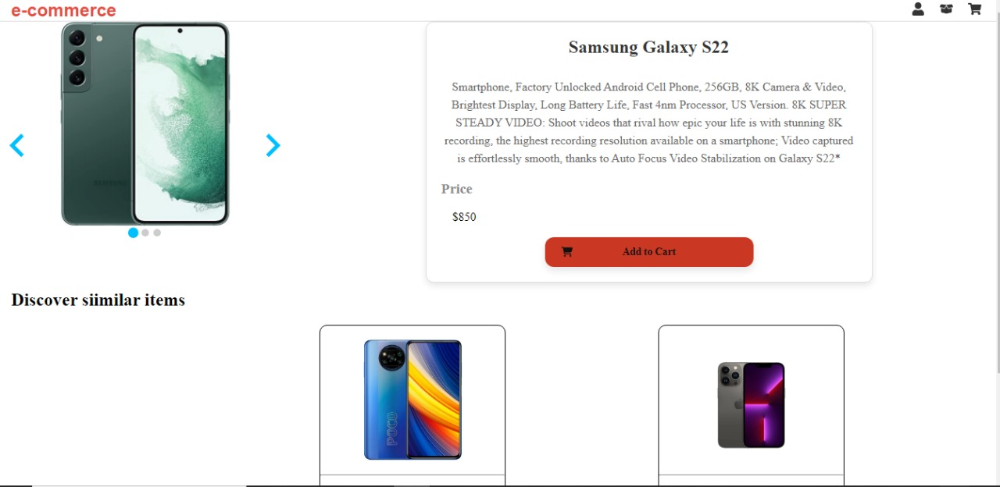

# E-Commerce Project

Este proyecto de e-commerce está diseñado para demostrar un sitio web básico de comercio electrónico con las siguientes funcionalidades:

- Registro e inicio de sesión de usuarios.
- Visualización y compra de productos.
- Uso de rutas personalizadas y hooks en React.
  
## Capturas





## Funcionalidades Implementadas

### 1. Registro e Inicio de Sesión

El proyecto incluye un formulario de registro y un formulario de inicio de sesión para que los usuarios puedan crear cuentas y acceder a sus perfiles.

### 2. Visualización de Productos

Los usuarios pueden ver una lista de productos disponibles para comprar. Cada producto tiene su propia página de detalle donde se muestra información detallada y opciones para agregar al carrito.

### 3. Carrito de Compras

Los usuarios pueden agregar productos al carrito de compras y luego proceder a la página de pago para completar la compra.

### 4. Rutas Personalizadas

Se utilizan rutas personalizadas utilizando React Router para gestionar la navegación entre diferentes secciones del sitio web, como la página de inicio, la lista de productos, y las páginas de perfil de usuario.

### 5. Hooks Personalizados

Se han implementado hooks personalizados para la gestión del estado global de la aplicación y la gestión de datos de usuario y productos de manera eficiente.

## Tecnologías Utilizadas

- **Frontend**: React.js, React Router, Redux (para el estado global), Hooks personalizados.
- **Backend**: Node.js (o cualquier backend de su elección para gestionar la lógica de negocio y la base de datos).

## Instalación y Uso

1. **Clonar el Repositorio**

   ```bash
   git clone 'https://github.com/DAlejandroCastro/e-commerse.git'
   cd e-commerce

## Instalar Dependencias

   npm install

## Ejecutar la Aplicación
   
   npm run dev

## Contribuciones
   Las contribuciones son bienvenidas. Si deseas mejorar este proyecto, por favor envía un pull request explicando los cambios propuestos.